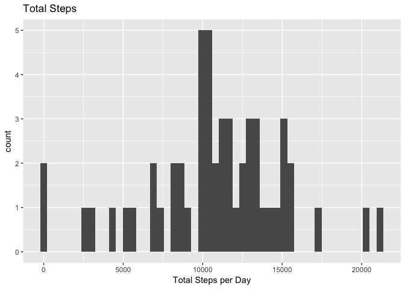
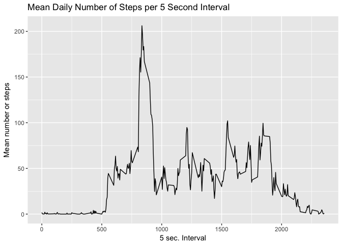
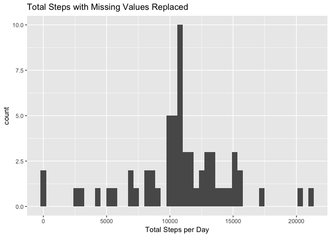
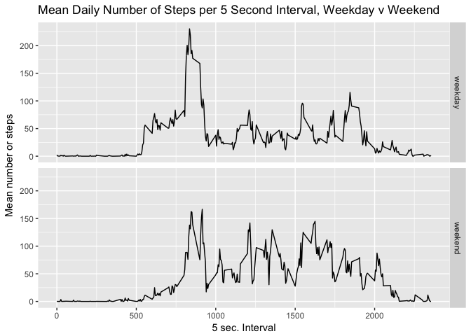

# Reproducible Research: Peer Assessment 1
Keith Erskine - May, 2017  
### Introduction

The goal of this assignment to analyize fitness tracking data (from assignment readme.md)

> This assignment makes use of data from a personal activity monitoring device. This device collects data at 5 minute intervals through out the day. The data consists of two months of data from an anonymous individual collected during the months of October and November, 2012 and include the number of steps taken in 5 minute intervals each day.

### Loading and preprocessing the data

The data is contained in a comma separated file located in the Github repository. Loading it into a dataframe is straight-forward:


```r
activity <- read.csv("activity.csv")
head(activity)
```

```
##   steps       date interval
## 1    NA 2012-10-01        0
## 2    NA 2012-10-01        5
## 3    NA 2012-10-01       10
## 4    NA 2012-10-01       15
## 5    NA 2012-10-01       20
## 6    NA 2012-10-01       25
```

```r
str(activity)
```

```
## 'data.frame':	17568 obs. of  3 variables:
##  $ steps   : int  NA NA NA NA NA NA NA NA NA NA ...
##  $ date    : Factor w/ 61 levels "2012-10-01","2012-10-02",..: 1 1 1 1 1 1 1 1 1 1 ...
##  $ interval: int  0 5 10 15 20 25 30 35 40 45 ...
```
The data set appears to be tidy with some missing values. The number of missing values can be determined this way:


```r
sum(is.na(activity$steps))
```

```
## [1] 2304
```
So, 13% of the step data is missing. More analysis of this will be done below.

### What is mean total number of steps taken per day?

First we need to plot the data to get a sense at where the mean and median are visually. To do this, we'll use dplyr"{aggregate}" on the data set, ignoring the missing data for the time being. We'll sum the steps using the date as a factor, then plot it.


```r
library(dplyr)
```

```
## 
## Attaching package: 'dplyr'
```

```
## The following objects are masked from 'package:stats':
## 
##     filter, lag
```

```
## The following objects are masked from 'package:base':
## 
##     intersect, setdiff, setequal, union
```

```r
total.steps <- aggregate(activity$steps, list(Date = activity$date), sum)
head(total.steps)
```

```
##         Date     x
## 1 2012-10-01    NA
## 2 2012-10-02   126
## 3 2012-10-03 11352
## 4 2012-10-04 12116
## 5 2012-10-05 13294
## 6 2012-10-06 15420
```
You'll see that the total steps get put into a column named x which helps explain the plotting code.

```r
library(ggplot2)

total.plot <- ggplot(total.steps, aes(x)) + 
        geom_histogram(bins = 50) + labs(x = "Total Steps per Day", title = "Total Steps")

print(total.plot)
```

```
## Warning: Removed 8 rows containing non-finite values (stat_bin).
```

<!-- -->

The plot almost appears to be a normal distribution, but we can easily get the mean and median from the data set.

```r
mean(total.steps$x, na.rm = TRUE)
```

```
## [1] 10766.19
```

```r
median(total.steps$x, na.rm = TRUE)
```

```
## [1] 10765
```

So, for the current data set,  the mean and median are approximately the same, around 10,765 steps per day. 

### What is the average daily activity pattern?

To find the average number of steps taken during the day, we'll use aggregate again


```r
steps.interval.mean <- aggregate(activity$steps, list(interval = activity$interval), mean, na.rm = TRUE)

sim.plot <- ggplot(steps.interval.mean, aes(interval, x)) + 
        geom_line() + labs(y = "Mean number or steps", x = "5 sec. Interval", 
                           title = "Mean Daily Number of Steps per 5 Second Interval")
print(sim.plot)
```

<!-- -->

The maximum average number is step occurs between interval 750 and 1,000. We can find the exact interval using this r expression:

```r
steps.interval.mean[which(steps.interval.mean$x == max(steps.interval.mean$x)), 1]
```

```
## [1] 835
```
Doing some math, you find that most of the steps occur around 9:00 in the morning.


### Imputing missing values
Note: Imputing is word: "assign (a value) to something by inference from the value of the products or processes to which it contributes." source: Google

Since we already average number of steps per interval, we'll use those values to replace the NA's in our data set. We'll create a new dataframe, activenona by mutating activity and adding another column with the average values:

```r
activenona <- mutate(activity, ave.int = rep(steps.interval.mean$x, 61))
```
Then, we'll use a for-loop to search and replace NA's with the average value for that internal. 


```r
for(i in 1:nrow(activenona)) {
        
        if(is.na(activenona$steps[i])) {
                
                activenona$steps[i] <- activenona$ave.int[i]
        }
        
}
```
Now as we did above with the original data set, we'll use aggregate to sum the steps, using the date as the factor, then plot it:


```r
total.steps.nona <- aggregate(activenona$steps, list(Date = activenona$date), sum)
totalnona.plot <- ggplot(total.steps.nona, aes(x)) + geom_histogram(bins = 50) +
        labs(x = "Total Steps per Day", title = "Total Steps with Missing Values Replaced")
print(totalnona.plot)
```

<!-- -->

The plots are very similar, so let's look at the median and mean again on the new data set


```r
mean(total.steps.nona$x)
```

```
## [1] 10766.19
```

```r
median(total.steps.nona$x)
```

```
## [1] 10766.19
```

These values are almost the same as the data set with missing values. Why? Perhaps the missing values are during times of minimal activity.


### Are there differences in activity patterns between weekdays and weekends?

To find the difference between between weekday and weekend activity, we'll first have to create a new factor variable wdwe. We'll use sapply for this, and then use mutate to add it as a column to data set


```r
wd <- c("Monday", "Tuesday", "Wednesday", "Thursday", "Friday")

wdwe <- sapply(activenona$date, function(x) {ifelse(weekdays(as.Date(x)) %in% wd, x<- "weekday", x <- "weekend")})

activenona <- mutate(activenona, wdwe)
```
Now we find the avereage steps using two factors; interval and whether it's a weekday or weekend. Finally, plot the result using a facet grid with ggplot


```r
steps.int.mean.nona <- aggregate(activenona$steps, list(interval = activenona$interval, 
                                                        wdwe = activenona$wdwe), mean)

g <- ggplot(steps.int.mean.nona, aes(interval, x)) + geom_line() + facet_grid(wdwe ~ .) + 
        labs(y = "Mean number or steps", x = "5 sec. Interval", 
             title = "Mean Daily Number of Steps per 5 Second Interval, Weekday v Weekend")
print(g)
```

<!-- -->

Looking at the plots:

 - On Weekdays, you get a high number of steps in the morning, but lower steps during the day
 - On Weekend, you get a lot of steps spread over the entire day
 
 
